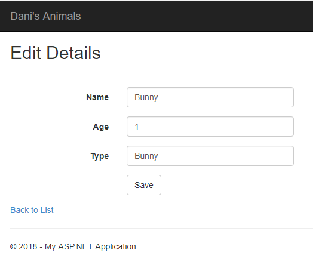

# Dani’s Animals

My wife has a hilariously large collection of stuffed animals. Some are new and some are old, and as I started learning how to build database applications, I had the fun idea to build an app that could allow her to add, update, and delete animals from a database representing her collection.

## Steps Taken
I created this project using Visual Studio’s ASP.NET MVC scaffolding to provide a fast front end that allows the user to access a database. I updated the RoutConfig.cs so that it would not require a different home controler to access the application. I also moved content around in the different views to quickly structure the pages the way I wanted. This means once the application is running, it is now fairly intuitive to use. 

## Outcome
The final product looks very simple, but it meets the functional requirements and provides the framework for smoothing out the interface in the future if needed. It was fun to see what the MVC framework is capable of in a short span of time, especially if this is the type of application you need!

### Screen Captures

